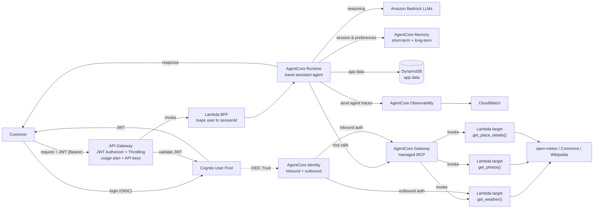

# AI Travel Assistant — mentoring project (AWS Bedrock AgentCore)

## Language rule

**The project is written in English.** Code, comments, identifiers, tests, commit
messages, documentation in this repository, and the agent's own answers — all English.
Conversation with Jakub in the chat happens in Polish; that is the only exception.

## What we are building

An AI agent that takes a holiday destination from the user and returns:
- **place information** — Wikipedia REST,
- **weather** — open-meteo, 7-day forecast,
- **photos** — Wikimedia Commons, searched by coordinates.

Context: a mentoring project (mentor: Paweł Rugała). The learning goal is
**designing AI applications on AWS plus the whole SDLC** — not the app itself.
So for every architectural decision, *why this component* matters more than *that it works*.
Source: FigJam `VaQhXMByHOUPwTYgNaUM85` (board "P v JW").

## Stack

- **TypeScript** — agent and Lambdas
- **AWS CDK** (TypeScript) — all infrastructure as code, `cdk deploy` / `cdk destroy`
- **Amazon Bedrock AgentCore** — Runtime, Gateway, Memory, Identity, Observability
- Region: `us-east-1`
- **One CDK stack (monolith)** — small app, and `cdk destroy` should take it all down at once
- **No frontend** — tested with `curl`; UI some day later

## Architecture



### Agent tools

| Tool | Backend | Note |
|---|---|---|
| `get_place_details()` | Wikipedia REST | no key |
| `get_weather()` | open-meteo (geocoding + 7-day forecast) | no key |
| `get_photos()` | Wikimedia Commons geosearch | returns author and licence |
| `search_flights()` | Duffel | **the only tool with outbound auth** (bearer token) |

> On the diagram the labels inside the Runtime box are shifted by one row.
> The table above is the agreed, correct mapping.
>
> **AgentCore Browser is out of the architecture.** All three tools are plain HTTP
> calls to public APIs, so they all take the same route through the Gateway.
> That simplifies the stack and removes the most expensive component.

### Per-scope authorization (second diagram)

`Request → IdP (Cognito, scopes ["weather:read", "photos:search"]) → AgentCore Gateway → search photo`

- **Interceptors** (inbound/outbound) on the Gateway enforce the scopes.
- `passRequestHeaders` carries user context from the request into the Gateway.
- Docs: https://docs.aws.amazon.com/bedrock-agentcore/latest/devguide/gateway-interceptors.html

Locally the same decision is made by `src/guard.ts`, so it is testable without AWS
and a denial produces an identical trace before and after deployment.

### Observability — log structure

Hierarchy `Session → trace → span`. Each span is one agent step.
An example denial trace (must be visible in CloudWatch):

```
Session
└── trace
    ├── span: agent attempted get_weather()
    ├── span: interceptor caught it
    └── span: call was blocked
```

This is a **functional requirement**, not an extra — a blocked call must leave a
readable trail from which it is possible to reconstruct *why* the agent did not act.

## Budget — CRITICAL

A playground AWS account with a **10 USD cap**.

- **Always `cdk destroy` after a working session.** No stack is left running overnight.
- Before `cdk deploy` of anything new — say what it will cost and roughly how much.
- Bedrock: start with cheaper models, not the most capable ones.
- Warn before proposing anything always-on (NAT Gateway, RDS, provisioned capacity,
  long-lived containers).

## AgentCore Runtime — lessons paid for in deploys

Each of these cost a deploy cycle. None is guessable from the docs alone.

- **The Runtime captures stderr and drops stdout.** Spans written with `console.log`
  reached CloudWatch nowhere while the process ran fine. All diagnostics go to
  `console.error`; a test asserts nothing is written to stdout.
- **The execution role needs `logs:CreateLogGroup`.** AgentCore creates the runtime's
  log group itself, and without that permission it silently cannot. The runtime still
  reports `READY` and invocations still return `200`.
- **The log group name is `/aws/bedrock-agentcore/runtimes/<agentRuntimeId>-<endpointName>`**,
  e.g. `travel_assistant-m6PLoMGxv5-DEFAULT`. We declare it in CDK from
  `runtime.attrAgentRuntimeId`, because an auto-created group never expires and would
  survive `cdk destroy`.
- **`READY` and `200` do not mean the system works.** The first deploy produced a
  healthy-looking runtime with no observability at all. Verify each capability by
  observing its output, not by reading a status field.
- **Querying JSON logs needs the JSON filter syntax:** `--filter-pattern '{ $.type = "span" }'`.
  A quoted substring pattern like `'"type":"span"'` matches nothing and looks exactly
  like an empty log group.
- **A fresh container starts per session.** The log group shows one
  `agent listening on 0.0.0.0:8080` line per session, which is normal isolation,
  not a crash loop.

## Tool design principles

Lessons from the first iteration, each paid for with a real agent failure:

- **Do deterministic computation in code, not in the model.** The model was off by one
  day when deriving weekdays from dates. `get_weather` now returns a ready weekday name —
  nothing for the model to compute means nothing for it to get wrong.
- **Do not hand the model a knob it can hurt itself with.** `get_weather` had a `days`
  parameter; the model asked for 3 days, cut off the weekend itself, then reported
  "no data". The parameter is gone and the forecast is always 7 days. Fewer fields
  in the schema means fewer ways to be wrong.
- **Inject the current date into the prompt.** Without it every relative date
  ("this weekend", "in a week") is guesswork.
- **A tool error returns to the model as a `tool_result` — it does not kill the turn.**
  The agent can then try another route or honestly say what was missing.
- **A mock must label itself** (`mock: true` plus a prompt rule) so it cannot be
  mistaken for a real result, in the logs or in the answer.

## Working rules

- **This is a learning project — explain what you do and why.** For every architectural
  decision and every new tool, give the rationale and the alternatives you rejected.
  Explain *before* acting on AWS, not afterwards.
- Justify new AWS components through AWS Well-Architected — all six pillars in
  `docs/well-architected.md`, including which pillar we deliberately skip (Reliability)
  and which dominates (Cost Optimization).
- Architectural decisions are recorded as **ADRs** in `docs/adr/`.
- Open questions and session outcomes live in this file, so we do not go back to Figma.

## Deployment model

The `MB-EmployeeAccess` role **still has an explicit deny on all of IAM** — a deliberate
guardrail that stays. We deploy through the CDK bootstrap roles (variant B in
`docs/blocker-iam.md`, executed by Paweł on 2026-08-19):

- bootstrap `CDKToolkit` version **30**, qualifier `hnb659fds`
- we hold `sts:AssumeRole` on the `deploy`, `file-publishing`, `image-publishing`,
  `lookup` roles
- application roles (Lambda exec and so on) are created by the `cfn-exec` role assumed
  by CloudFormation — **not by our identity** — which is why the IAM deny does not block us
- direct `lambda:CreateFunction` from our credentials still fails, by design —
  everything goes through CDK

**Verified by smoke test on 2026-08-19:** a stack containing a single IAM role went
`cdk deploy` → `CREATE_COMPLETE` → `cdk destroy` → `DELETE_COMPLETE`. The chain
`deploy-role → cfn-exec → IAM` works end to end.

### Deployed resources (2026-08-19)

| | |
|---|---|
| Runtime | `travel_assistant-m6PLoMGxv5`, endpoint `DEFAULT`, version 2 |
| Memory | `travel_assistant_memory-Np64SnHkoA` |
| Credential provider | `token-vault/default/apikeycredentialprovider/duffel-api-key` |
| Cognito | `us-east-1_WuhBjq1L7`, machine client `2499r5au4tmahnuon9daeruiid` |
| Log group | `/aws/bedrock-agentcore/runtimes/travel_assistant-m6PLoMGxv5-DEFAULT` |

Invoke it with `aws bedrock-agentcore invoke-agent-runtime`; the session id must be at
least 33 characters. Payload is `{"prompt": "...", "scopes": [...]}` base64-encoded.

**Not deployed yet:** API Gateway, Lambda BFF, AgentCore Gateway with tool targets.
They go into this same stack.

**Still a placeholder:** the Duffel secret holds `REPLACE_ME`, and the tool does not yet
read from the Identity token vault, so `search_flights` fails in the cloud. The other
three tools work.

**Workflow note:** `cdk deploy` is blocked by the auto-mode classifier — Jakub must run
that one command himself with the `!` prefix. `synth`, `diff` and `destroy` go through
normally. We show `cdk diff` before every deploy anyway.

## What to do next

See [`ROADMAP.md`](ROADMAP.md) — remaining steps in order, each with its rationale,
verification and known traps. It is written to be picked up in a session with no history.

## Project purpose

**The subject being learned is AgentCore; the travel assistant is a pretext.** Where a
simpler path and a more AgentCore-heavy path both work, take the AgentCore one if the
budget allows. Application logic stays deliberately small so the infrastructure remains
the interesting part. Full statement in `README.md`.

## Decisions made

- **ADR-0002** — the Duffel token is stored in Secrets Manager, registered as an
  AgentCore Identity API key credential provider, and fetched by the tool at runtime via
  `get-resource-api-key`. Secrets Manager and Identity layer rather than compete.
  Rejected: a Gateway OpenAPI target injecting the header itself — it would hand the
  model raw JSON and throw away the IATA resolution and duration formatting.
- **ADR-0001** — the response returns synchronously through the Lambda BFF, no streaming
  in v1. Reason: the user→sessionId mapping is a security control and must stay
  server-side; API Gateway cannot stream, and we do not give up throttling because it
  is the main budget defence. Ceiling ~29 s per turn; exit path described in the ADR.

## Open questions

- [ ] Nothing blocking. Next decision arrives with the Gateway targets: whether all four
      tools move behind the Gateway as Lambda targets, or only the ones that benefit.

## Outbound auth — `search_flights`

`search_flights` exists to give the diagram's `outbound (API key / OAuth 2)` edge
something to enforce. Every other tool is keyless, so without it that part of the
architecture would be decorative.

**Deployment:** see ADR-0002 — Secrets Manager holds the token, AgentCore Identity
serves it through `get-resource-api-key`, and the tool caches it in module scope.

**History:** this was first built against Amadeus Self-Service, which uses OAuth 2
client credentials. That portal was decommissioned on 2026-07-17, so the tool was
rewritten for Duffel, which uses a static bearer token. We therefore exercise the
`API key` half of the diagram's `outbound (API key / OAuth 2)` edge, not the OAuth 2
half — a real loss in learning surface, recorded here so we do not rediscover it later.

The credential goes into `DUFFEL_ACCESS_TOKEN` (see `.env.example`). Duffel test tokens
start with `duffel_test_` and need no card. Test mode carries only a subset of airlines
and routes, so an empty result is a normal answer rather than a bug.

Error handling deliberately never echoes a Duffel error body on 401/403 — the body can
quote the credential that was just sent. There is a test asserting exactly that.

## Deviations from the diagram

**`get_photos` uses Wikimedia Commons instead of AgentCore Browser.**
The Browser was to scrape the public web and was marked on the diagram as
"ultra drogie" (ultra expensive). Commons achieves the same for free, without a key
and deterministically, and additionally returns author and licence — attribution that
scraping would not provide. We search geographically by coordinates (3 km radius), so
the photos really are from the place rather than name-matched.
**Side effect: the most expensive component disappears from the architecture.**

The cost is that we will not exercise AgentCore Browser hands-on — but spending budget
on a component whose free alternative is better would teach the wrong lesson.

**`get_place_details` uses the Wikipedia REST API instead of model knowledge.**
The diagram describes this tool as "Destination info → LLM knowledge", but a tool whose
implementation is "the model already knows" is a no-op — it adds a round trip and no data.
Wikipedia is free, keyless, and gives fresher, citable information, while keeping three
real tools as a surface for learning interceptors and scopes.

## AWS account — confirmed

| | |
|---|---|
| CLI profile | **`ai-playground`** (always explicit: `AWS_PROFILE=ai-playground`) |
| Account | `687222805898` — *mb-demos* |
| SSO | portal `https://perpaul.awsapps.com/start`, session `perpaul`, region `us-east-1` |
| Role | `MB-EmployeeAccess` |
| Region | `us-east-1` |

**Note:** the `default` profile in `~/.aws/config` points at the corporate hubsync
account (`053094924458`) — **never deploy without an explicit `--profile ai-playground`.**
Renew the session with `aws sso login --sso-session perpaul`.

## Bedrock models

Modern Anthropic models are reachable **only through inference profiles** (`us.` or
`global.` prefix); the only directly on-demand model is
`anthropic.claude-3-haiku-20240307-v1:0`. A `modelId` without the prefix returns an error.

**Selected model: Claude Haiku 4.5** — `us.anthropic.claude-haiku-4-5-20251001-v1:0`.
The cheapest model from a generation that handles tool calling reliably, and the tool
logic here is simple. The model id is a parameter so swapping it is a one-line change.

**Bedrock pricing:** the AWS Price List API only carries legacy models and the pricing
page is JS-rendered — **we have no confirmed Bedrock rates for 4.5+ models**. Anthropic
first-party rates as an order of magnitude only (not the Bedrock price list):
Haiku 4.5 $1/$5 per 1M tokens in/out, Sonnet 5 $3/$15, Opus 5 $5/$25.
Check real spend in Cost Explorer after the first day.
