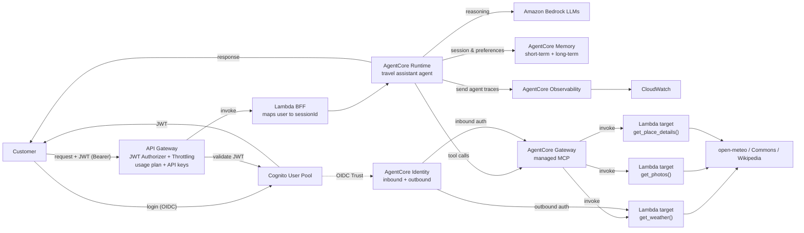

# AI Travel Assistant — mentoring project (AWS Bedrock AgentCore)

## Language rule

**The project is written in English.** Code, comments, identifiers, tests, commit
messages, documentation in this repository, and the agent's own answers — all English.
Conversation with Jakub in the chat happens in Polish; that is the only exception.

## What we are building

An AI agent that takes a holiday destination from the user and returns:
- **place information** — Wikipedia REST,
- **weather** — open-meteo, 7-day forecast,
- **photos** — Wikimedia Commons, searched by coordinates.

Context: a mentoring project (mentor: Paweł Rugała). The learning goal is
**designing AI applications on AWS plus the whole SDLC** — not the app itself.
So for every architectural decision, *why this component* matters more than *that it works*.
Source: FigJam `VaQhXMByHOUPwTYgNaUM85` (board "P v JW").

## Stack

- **TypeScript** — agent and Lambdas
- **AWS CDK** (TypeScript) — all infrastructure as code, `cdk deploy` / `cdk destroy`
- **Amazon Bedrock AgentCore** — Runtime, Gateway, Memory, Identity, Observability
- Region: `us-east-1`
- **One CDK stack (monolith)** — small app, and `cdk destroy` should take it all down at once
- **A frontend only as a test harness** — one static page in `web/` (no framework, no build,
  served from `localhost`) that exists to demonstrate the login; `curl` and the `.http`
  collections remain the working interface. ADR-0007.

## Architecture



### Agent tools

| Tool | Backend | Note |
|---|---|---|
| `get_place_details()` | Wikipedia REST | no key |
| `get_weather()` | open-meteo (geocoding + 7-day forecast) | no key |
| `get_photos()` | Wikimedia Commons geosearch | returns author and licence |
| `search_flights()` | Duffel | **the only tool with outbound auth** (bearer token) |

The first three run in a **Gateway Lambda target** after ADR-0004; `search_flights` stays in
the Runtime container because its credential comes from the Identity token vault.

> On the diagram the labels inside the Runtime box are shifted by one row.
> The table above is the agreed, correct mapping.
>
> **AgentCore Browser is out of the architecture.** All three tools are plain HTTP
> calls to public APIs, so they all take the same route through the Gateway.
> That simplifies the stack and removes the most expensive component.

### Per-scope authorization (second diagram)

`Request → IdP (Cognito, scopes ["weather:read", "photos:search"]) → AgentCore Gateway → search photo`

- **Interceptors** (inbound/outbound) on the Gateway enforce the scopes.
- `passRequestHeaders` carries user context from the request into the Gateway.
- Docs: https://docs.aws.amazon.com/bedrock-agentcore/latest/devguide/gateway-interceptors.html

Locally the same decision is made by `src/guard.ts`, so it is testable without AWS
and a denial produces an identical trace before and after deployment.

### Observability — log structure

Hierarchy `Session → trace → span`. Each span is one agent step.
An example denial trace (must be visible in CloudWatch):

```
Session
└── trace
    ├── span: agent attempted get_weather()
    ├── span: interceptor caught it
    └── span: call was blocked
```

This is a **functional requirement**, not an extra — a blocked call must leave a
readable trail from which it is possible to reconstruct *why* the agent did not act.

## Budget — CRITICAL

A playground AWS account with a **10 USD cap**.

- **Always `cdk destroy` after a working session.** No stack is left running overnight.
- Before `cdk deploy` of anything new — say what it will cost and roughly how much.
- Bedrock: start with cheaper models, not the most capable ones.
- Warn before proposing anything always-on (NAT Gateway, RDS, provisioned capacity,
  long-lived containers).

## AgentCore Runtime — lessons paid for in deploys

Each of these cost a deploy cycle. None is guessable from the docs alone.

- **The Runtime captures stderr and drops stdout.** Spans written with `console.log`
  reached CloudWatch nowhere while the process ran fine. All diagnostics go to
  `console.error`; a test asserts nothing is written to stdout.
- **The execution role needs `logs:CreateLogGroup`.** AgentCore creates the runtime's
  log group itself, and without that permission it silently cannot. The runtime still
  reports `READY` and invocations still return `200`.
- **The log group name is `/aws/bedrock-agentcore/runtimes/<agentRuntimeId>-<endpointName>`**,
  e.g. `travel_assistant-m6PLoMGxv5-DEFAULT`. We declare it in CDK from
  `runtime.attrAgentRuntimeId`, because an auto-created group never expires and would
  survive `cdk destroy`.
- **`READY` and `200` do not mean the system works.** The first deploy produced a
  healthy-looking runtime with no observability at all. Verify each capability by
  observing its output, not by reading a status field.
- **Querying JSON logs needs the JSON filter syntax:** `--filter-pattern '{ $.type = "span" }'`.
  A quoted substring pattern like `'"type":"span"'` matches nothing and looks exactly
  like an empty log group.
- **An existing session keeps its warm container across a deploy.** After a runtime update
  removed an environment variable, the next request on an established session was still served
  by the old container — same cached state, no new startup diagnostics. So a `200` right after a
  deploy can be the *previous* version answering. A session id nothing has used before forces a
  cold container on the new version, and that is the only run that proves the change:
  `aws bedrock-agentcore invoke-agent-runtime --runtime-session-id <fresh 33+ chars> ...`.
- **A fresh container starts per session.** The log group shows one
  `agent listening on 0.0.0.0:8080` line per session, which is normal isolation,
  not a crash loop.

## API Gateway and Lambda — lessons paid for in deploys

- **A new API key needs ~a minute to propagate.** Immediately after `cdk deploy` a
  correct request returns `403` with `x-amzn-errortype: ForbiddenException` and
  `{"message":"Forbidden"}`. Every piece of configuration — usage plan, stage
  association, key state, authorizer, scopes — checked out fine; only time was missing.
  Diagnostic: a 403 whose body is *not* our JSON error shape means the request never
  reached the integration.
- **Bundle the Lambda as CJS, not ESM.** AWS SDK v3 is CommonJS internally; bundled into
  an ESM output it calls `require("node:https")` at load time and the function dies in
  INIT with `Dynamic require of "node:https" is not supported`. API Gateway shows only a
  bare `502 Internal server error`. The common `createRequire` banner hides the mismatch
  rather than removing it. Our source stays ESM; only esbuild's output format changed.
- **`cdk synth` succeeding says nothing about the bundle running.** The unit tests import
  TypeScript source, and synth only checks that esbuild exited zero. `npm run verify:bundle`
  loads the artifact from `cdk.out` the way Lambda does — this is the same principle as
  "`READY` and `200` do not mean it works", one layer down.
- **`verify:bundle` must check only the bundles esbuild built for us.** Adding
  `logs.LogRetention` put a *CDK-authored* Lambda into `cdk.out`, and loading it locally failed on
  a missing `@aws-sdk/client-cloudwatch-logs` — a module the Lambda runtime provides and our
  `node_modules` does not. The gate went red for something that was never our code and would have
  broken CI. The script now reads this synth's template (which names the construct each asset
  belongs to) and skips any bundle with no esbuild sourcemap beside it, printing what it skipped.
  A red gate that says nothing about our code is worse than no gate, because the next person
  silences it.
- **`cdk.out` inherits `infra/package.json`'s `"type": "module"`.** A CJS bundle sitting
  there is parsed as ESM by Node and appears to export nothing. Lambda unzips the asset
  with no such parent, so any check must copy the artifact out of the tree first —
  otherwise it reports a failure that will not happen, or misses one that will.

## AgentCore Memory — traps found while wiring it up

- **Every event carries an `actorId` *and* a `sessionId`, and `ListEvents` needs both.**
  The actor is the person, the session is the conversation. Long-term namespaces are
  keyed on the actor, so choosing to collapse the two is a decision you cannot cheaply
  undo once records exist. We derive both from the same Cognito `sub` with different
  domain separators — same source today, separable tomorrow.
- **`eventExpiryDuration` bounds raw events only.** Extracted long-term records have
  their own lifetime. That split is the point: the conversation is cheap to forget, the
  lesson is not.
- **Strategies run under a separate `MemoryExecutionRoleArn`**, not the runtime role —
  extraction happens on AWS's schedule, outside our container. Its `bedrock:InvokeModel`
  policy has to be wider than the runtime's, because AWS picks the extraction model. A
  policy pinned to our inference profile would fail *silently*, as a strategy that quietly
  stops producing records.
- **`ListEvents` promises no order.** A reversed history is worse than none — the model
  reads every answer before its question. Sort by `eventTimestamp` yourself.
- **Converse rejects a message list that does not strictly alternate from `user`,** and
  rejects the whole turn. One half-written event would therefore poison every later turn
  in that session permanently, so `alternating()` drops what breaks the pattern instead
  of forwarding it.
- **Adding a strategy to an existing `CfnMemory` updates in place** — `cdk diff` showed
  `[~]`, not a replacement, so the memory id and its stored events survive.
- **Long-term extraction is asynchronous — a few minutes after the turn.** Immediately
  after a two-turn conversation `retrieve-memory-records` returned `[]`; the same query a
  few minutes later returned two correct preference records. An empty namespace right
  after a turn proves nothing, in either direction.
- **`list-memory-extraction-jobs` returned `[]` the whole time, including after extraction
  had demonstrably run.** It appears to list only jobs started explicitly with
  `StartMemoryExtractionJob`, not the strategy's own scheduled runs. An empty job list is
  therefore not a signal, and reading it as one nearly cost us a wrong conclusion about a
  working strategy.
- **A `USER_PREFERENCE` record stores serialised JSON, not prose:**
  `{"context": ..., "preference": ..., "categories": [...]}`. Only `preference` belongs in
  the prompt — `context` restates the turn it came from and `categories` are retrieval
  metadata, so passing `content.text` straight through spends three fields of tokens on
  one field of meaning, on every turn. `preferenceText()` unwraps it and falls back to the
  raw string, because the shape is AWS's to change.
- **Recall costs ~0.5 s per turn, and it is the search that costs it.** Measured from the
  spans: `memory.load_history` 81–119 ms and `memory.load_preferences` 338–370 ms run
  concurrently, then `memory.save_turn` 110–131 ms. Against ADR-0001's ~29 s ceiling this
  is affordable, but it is the first thing on the critical path that is not a model call.

## AgentCore Gateway — facts and traps found while wiring it up

Built in ROADMAP step 4, design in ADR-0004. Everything here is verified against the docs
or against `cdk synth`, not remembered.

- **Gateway and gateway-target names forbid underscores** — validated against
  `^([0-9a-zA-Z][-]?){1,100}$`. `CfnRuntime` is the opposite: `travel_assistant` *needs*
  them. So the gateway is `travel-assistant-gateway` and the target is `travel-tools`.
  `cdk synth` reports the mismatch as a **warning**, not an error, so it is easy to deploy
  straight past it.
- **The Gateway is an MCP server, not an AWS API.** There is no `InvokeGatewayTool` SDK
  call: `attrGatewayUrl` is a full endpoint ending in `/mcp`, and a client speaks JSON-RPC
  2.0 over Streamable HTTP. `src/mcp/client.ts` is ours, hand-rolled, ~200 lines.
- **A Lambda target receives the tool arguments as its whole `event`.** The tool name comes
  from `context.clientContext.custom.bedrockAgentCoreToolName`, prefixed with the target
  name and `___`, and the docs are explicit that **stripping the prefix is the function's
  job**. `src/gateway/naming.ts` owns that string for all three components that need it.
- **`interceptionPoints` are exactly `REQUEST` and `RESPONSE`**, at most one interceptor of
  each per gateway. A REQUEST interceptor runs on *every* call — `initialize`,
  `notifications/initialized`, `tools/list` — so anything that is not `tools/call` has to be
  passed through explicitly.
- **A REQUEST interceptor answers the caller by returning `transformedGatewayResponse`.**
  Return it and the target is never invoked. Our denial is shaped as a JSON-RPC *success*
  carrying `isError: true`, because that reaches the model as a failed `tool_result` it can
  explain, whereas a JSON-RPC error surfaces as a broken tool.
- **The interceptor sees request headers only with `passRequestHeaders: true`**, which means
  it holds a live access token in memory. There is a test asserting it never writes one to a
  log.
- **`Session → trace → span` does not survive the Gateway on its own.** AgentCore forwards
  no session id to a target or an interceptor. The interceptor gets ours back because the
  MCP client sends `x-travel-session-id`; the **target Lambda cannot**, so a tool-execution
  span correlates through the interceptor's span for the same MCP message id.
- **A Lambda target's credential config is the bare type `GATEWAY_IAM_ROLE` with no
  `credentialProvider` object** — and this one cost a deploy. Adding
  `iamCredentialProvider: { service: 'lambda', region }`, which the **CLI reference shows in
  its own Lambda-target example**, is rejected at create time: *"IamCredentialProvider is not
  supported for this target type. Only MCP Server, OpenAPI, and Passthrough targets can
  configure IamCredentialProvider."* The API reference is the source that is right —
  `credentialProviderType` required, `credentialProvider` optional. `cdk synth` cannot catch
  this: it is a service-side constraint on a field combination the CFN schema permits.
  General lesson: for AgentCore, trust `API_*.html` over a CLI-reference example.
- **The Gateway supports exactly one MCP protocol version and rejects any other in the
  header**: `2025-03-26`. It says so usefully —
  `{"code":-32600,"message":"Unsupported protocol version: 2025-06-18","data":{"requested":...,"supported":["2025-03-26"]}}`.
  Our client survived this without a change because it sends its preferred version to
  `initialize` and then **adopts whatever the server answered with**; the smoke script, which
  does no handshake and pinned `2025-06-18`, failed on the same run. Negotiate, do not pin.
- **A REQUEST interceptor runs *before* the Gateway validates the protocol version.** Proved
  by accident: on the run above, with a bad version header, a scope-*denied* `tools/call`
  returned the interceptor's denial while a scope-*allowed* one returned the version error.
  So a denial short-circuits the entire pipeline — and the interceptor must not assume it is
  handed a request the Gateway has already found well-formed.
- **`bedrockAgentCoreMcpMessageId` is the JSON-RPC id, a per-connection counter.** The first
  deployed run logged `"sessionId": "4"`. It restarts at 1 for every conversation, so it is
  useless as a correlation key and belongs in a span attribute, not as its id.
- **The rest of the Gateway config was validated by that same failed deploy**, which is worth
  knowing: `Gateway` reached `CREATE_COMPLETE` before the target failed, so
  `authorizerType: CUSTOM_JWT`, the Cognito discovery URL, `allowedClients`, and the
  `REQUEST` interceptor with `passRequestHeaders` are all accepted as written. A rollback is
  not only a loss — it tells you which half of the change was right.
- **`allowedClients`, not `allowedAudience`, for Cognito machine tokens.** A
  client-credentials access token carries `client_id` and no `aud`, so an audience check
  rejects every token our machine client issues.
- **`SchemaDefinition` is a subset of JSON Schema** — `type`, `description`, `properties`,
  `required`, `items`, and nothing else. `infra/lib/tool-schema.ts` generates the target's
  schema from each tool's own `inputSchema` and **throws** on any other keyword rather than
  dropping it.
- **Gateway logs go to `/aws/bedrock-agentcore/gateways/<gatewayId>`** and the role needs
  `logs:CreateLogGroup` for the same reason the Runtime did. We declare the group in CDK so
  it expires and so `cdk destroy` removes it.

## AgentCore Identity, outbound auth — facts paid for in deploys

Built in ROADMAP step 2, design and its two wrong premises in ADR-0002. Every line here was
measured in the cloud; the docs alone would have produced a different, non-working design.

- **A workload access token reaches the container only if the invocation names a user.** With
  plain SigV4 `InvokeAgentRuntime` the container received `accept`, `baggage`, `content-*`,
  `host`, the session id, `x-amzn-requestid`, `x-amzn-trace-id` — **no token header at all**.
  The automatic delivery the docs describe runs `GetWorkloadAccessTokenForJWT`, which needs an
  end user. Passing `runtimeUserId` on the invocation switches AgentCore to the
  `GetWorkloadAccessTokenForUserId` path and the token appears. It costs the caller role
  `bedrock-agentcore:InvokeAgentRuntimeForUser` on top of `InvokeAgentRuntime`.
- **With a user named, AgentCore injects the token under three different header names:**
  `workloadaccesstoken`, `x-amz-bedrock-agentcore-identity-wat` and
  `x-amzn-bedrock-agentcore-runtime-workload-accesstoken`. The Python SDK's constants name only
  the first two, so a client that knows just one name is fine — but only by luck. We read the
  `identity-wat` one and fall back to `workloadaccesstoken`.
- **AWS treats `runtimeUserId` as an unverified opaque string**, so its integrity is entirely
  ours to provide. We pass the actor id derived from the token's `sub` — the same id that owns
  long-term memory, which binds an agent's credentials and its memories to one identity by
  construction. A client-supplied value would be horizontal privilege escalation into another
  user's stored credentials, so the BFF is the only component allowed to set it.
- **A runtime-managed workload identity cannot fetch its own token, by design.** "Runtime-managed
  and Gateway-managed workload identities cannot retrieve tokens directly. This prevents agents
  from extracting tokens for misuse." So the CLI error *"WorkloadIdentity is linked to a service
  and cannot retrieve an access token by the caller"* is permanent — there is no fallback to
  `GetWorkloadAccessToken` worth writing.
- **`GetResourceApiKey` reads an `EXTERNAL` secret as the *calling workload*, not as a service
  principal of its own.** Its AccessDenied named our runtime execution role by ARN, so the fix is
  `secretsmanager:GetSecretValue` on the runtime role. This qualifies ADR-0002: with BYOS the
  container does hold a Secrets Manager permission.
- **The resource policy the feature's launch blog prescribes cannot be written.** It says to allow
  `identity.bedrock-agentcore.amazonaws.com`; Secrets Manager rejects that principal in
  CloudFormation and in `put-resource-policy` alike — *"This resource policy contains an
  unsupported service principal."* Probed by hand: `bedrock-agentcore.amazonaws.com` and
  `runtime-identity.bedrock-agentcore.amazonaws.com` are accepted, the documented one is not.
  Since the read happens as the caller, no resource policy is needed at all.
- **`update-api-key-credential-provider` succeeds with no read access to the secret**, so the
  control plane validates nothing about the secret at write time. A provider that reads back fine
  from `get-api-key-credential-provider` still tells you nothing about whether the key can be
  fetched.
- **A once-per-container diagnostic is invisible on a warm container.** The header-name line is
  logged once per process, so after a code change the running container for an existing session
  never prints the new information. A fresh session id forces a cold container:
  `aws bedrock-agentcore invoke-agent-runtime --runtime-session-id <new 33+ chars> --runtime-user-id ...`.

## Gateway interceptors — the RESPONSE point, paid for in four deploys

The FigJam board draws `interceptors inbound` **and** `interceptors outbound`. The outbound one
is `src/gateway/responseInterceptor.ts`, and its job is not decoration: AgentCore forwards no
session id to a target and our `x-travel-session-id` header reaches interceptors but not
targets, so this is the only place a tool's *result* and the conversation that asked for it
meet. It observes and never transforms.

- **A gateway takes at most one interceptor per point**, and one Lambda could serve both. Ours
  are two functions on purpose: REQUEST is a security control whose failure must deny a tool
  call, RESPONSE is telemetry whose failure must cost nothing but a span. Sharing a function
  would let a bug in observability refuse tool calls.
- **`{"interceptorOutputVersion":"1.0","mcp":{}}` is NOT pass-through for an MCP target.** The
  empty-object rule in the docs is written for **HTTP** targets. Returning it made the gateway
  answer every call with an empty body — `tools/list` and `tools/call` both came back `{}` —
  while the interceptor's own spans showed the calls succeeding. Echo an identity transform
  instead: `transformedGatewayResponse` with the `statusCode` and `body` you were handed.
- **Response headers never arrive.** `gatewayResponse.headers` is empty in practice even though
  the docs' example shows headers, so there is nothing to echo — and echoing an empty object
  would override the real ones. Harmless for this gateway, which assigns no `Mcp-Session-Id` at
  all: verified by hand that `initialize` → `notifications/initialized` → `tools/list` works
  with no session header anywhere.
- **A denial reaches the RESPONSE interceptor too.** The docs say so for MCP targets: if the
  REQUEST interceptor short-circuits with a `transformedGatewayResponse`, the RESPONSE
  interceptor still runs. So the outbound span has to recognise `blocked: true` and record a
  refusal as `blocked`, not as a tool that ran and failed — otherwise every denial reads as an
  outage. (For HTTP targets the docs say the opposite: a short-circuit skips it.)
- **The gateway may retry an interceptor**, so the docs ask for idempotency. A duplicated span
  is a duplicated observation, not a duplicated effect, which is why writing one is safe here.

## Verifying a deploy — the trap that cost three of them

- **A session keeps its warm container across a deploy.** `idleRuntimeSessionTimeout` defaults
  to **900 s**, and every re-run of a smoke script resets that timer, so "deploy, then verify"
  can grade code that is not running. We now set `idleRuntimeSessionTimeout: 120` and
  `maxLifetime: 3600`: the conversation lives in Memory, not in the container, so the only cost
  is a cold start after a pause — and an idle container is billed for nothing. **A lifecycle
  change applies to new sessions; the session already running keeps the old window**, so the old
  container still has to age out before the API path can be trusted.
- **The runtime answers with `build`**, the container image's asset tag, forwarded by the BFF and
  printed by the smoke scripts. It is the only way to tell "the deploy worked" from "a container
  from before the deploy answered me".
- **Never do string arithmetic on a CDK token.** `image.imageUri.slice(-12)` at synth time slices
  the *placeholder* and shipped `n[TOKEN.78]}` as the build id. Pass the whole token
  (`image.imageTag`) and shorten it at runtime.
- **A fresh session id forces a cold container**, and a direct invoke is the way to get one:
  `aws bedrock-agentcore invoke-agent-runtime --runtime-session-id <fresh 33+ chars>
  --runtime-user-id u-probe --payload <base64 with accessToken>`. The API path cannot do this,
  because the BFF derives the session id from the token — which is the security control.
- **`durationMs: 0` on a span that does I/O means no I/O happened.** That is how we found the MCP
  client memoising a *rejected* handshake promise: one bad container start then failed every
  later turn in that session, replaying the original error for free. A failed handshake must be
  forgotten so the next turn retries.

## CDK ordering — two deploys, and they are the same bug twice

Both were found on the Step 10 deploy, neither is about the login, and neither is visible in
`cdk synth`. The theme: **CloudFormation orders what you reference, and AgentCore does work the
moment a resource exists.** Anything between those two facts is a race.

- **`roleArn` orders the role, not the role's policy.** `CfnRuntime` takes
  `roleArn: runtimeRole.roleArn`, so the role is created first — but the permissions CDK
  generates from `addToPolicy`/`grantPull` live in a *separate* `AWS::IAM::Policy` resource that
  is free to be created in parallel with the runtime. AgentCore validates the ECR image **as the
  execution role** at create time, so losing that race fails the whole stack with a message that
  reads like a missing permission: *"Access denied while validating ECR URI ... requires
  ecr:GetAuthorizationToken, ecr:BatchGetImage, and ecr:GetDownloadUrlForLayer"* — while the next
  event, `RuntimeRoleDefaultPolicy ... Resource creation cancelled`, is the actual story. Fix:
  `runtime.node.addDependency(runtimeRole)`, which covers **every resource in the construct's
  subtree**, generated policies included. `addResourceDependency(role.node.defaultChild)` would
  not. Read a "missing IAM permission" on a resource whose policy is in the same stack as an
  ordering bug until proven otherwise.
- **You cannot own the Runtime's log group, only its retention** — and the previous fix is what
  exposed this. The group's name contains the runtime id, so it can only be created *after* the
  runtime; the runtime's role holds `logs:CreateLogGroup` precisely so AgentCore can create it.
  Measured: AgentCore created it **3 s** after the runtime, CloudFormation reached its own
  `AWS::Logs::LogGroup` a second later, `already exists`, stack rolled back. The two requirements
  are in direct conflict. `logs.LogRetention` is the construct for a group somebody else owns —
  it creates the group only if missing, sets the retention, and with
  `removalPolicy: RemovalPolicy.DESTROY` deletes it on teardown. Same two guarantees, no
  ownership claim. Verified after the deploy: the group exists with `retentionInDays: 7`.
- **The earlier deploys that "worked" were the broken ones.** Before the policy was ordered
  first, the role had no `logs:CreateLogGroup` when the runtime started, so AgentCore silently
  could not create the group and CloudFormation won by default. That is the same silence
  `CLAUDE.md` already recorded under the Runtime section — the deploy succeeded *because* its
  observability was failing. A green deploy can be green for the wrong reason.
- **The Gateway's log group needs none of this.** It is created lazily on the first request,
  long after CloudFormation is done, so `new logs.LogGroup` there is correct and stayed.
- **A `ROLLBACK_COMPLETE` stack must be deleted before the next attempt**, and a rolled-back
  runtime leaves its auto-created log group behind — exactly the orphan the CDK declaration
  exists to prevent. Check `aws logs describe-log-groups --log-group-name-prefix
  /aws/bedrock-agentcore` after any failed deploy.

## Login and the browser harness — Step 10

- **`allowedClients` on the Gateway is the single most likely thing to forget.** Add a Cognito
  app client and the Gateway rejects its tokens until that client id is on the list. The symptom
  is a perfect login followed by *every* tool call failing, which reads as a broken agent rather
  than a missing config line.
- **`USER_PASSWORD_AUTH` tokens carry no custom scopes** — only
  `aws.cognito.signin.user.admin`. They pass API Gateway's authorizer and are then refused by
  every tool at the Gateway, so the two layers disagree. Both clients keep the flow disabled;
  this is why the login had to be a browser flow rather than a shell script.
- **API Gateway's `authorizationScopes` is an OR, not an AND.** All four tool scopes are listed
  on the `POST /chat` method and a token holding *one* of them is admitted — which is what makes
  the "uncheck photos, keep weather" demonstration reach the BFF at all. An AND would refuse the
  request before the interceptor could produce its denial trace. (Do not add `authorizationScopes`
  per tool for the same reason: the per-tool decision belongs to the Gateway interceptor.)
- **CORS has to cover the error responses, not just the preflight.** API Gateway's mock `OPTIONS`
  integration handles the preflight; it says nothing about what the BFF returns. Without
  `access-control-allow-origin` on a 403, the browser reports a CORS failure and hides the status
  and the body — the failures worth debugging are exactly the ones that vanish. The header is in
  `respond()` in `src/bff/handler.ts` and there is a test asserting it on every refusal.
- **The preflight must not require the authorizer or the API key.** A preflight carries neither,
  so demanding them refuses the request before the token is ever seen. CDK's
  `defaultCorsPreflightOptions` gets this right (`AuthorizationType: NONE`, `ApiKeyRequired:
  false`) — worth confirming in the synthesized template rather than trusting.
- **PKCE: base64url with no padding.** A padded `code_challenge` comes back as a bare
  `invalid_grant` from the token endpoint, one redirect after the mistake was made.
- **`admin-set-user-password --permanent`**, or the user sits in `FORCE_CHANGE_PASSWORD` and the
  hosted UI demands a new password that a scripted check cannot supply.
- **The callback URL is compared as a string**, trailing slash included, which is why the page is
  served on `:5173` and the port is not a preference.
- **Log out of Cognito, not just of the page.** Clearing the token locally leaves Cognito's own
  session alive, so the next login silently reuses it. Useful either way: with the SSO session
  kept, re-authorizing with a different `scope` returns a *new* token with the new scopes and no
  password prompt — which is how the scope demonstration was verified as one user in one Cognito
  session. But a full `/logout` is what a *different* user needs, hence the button.
- **`access-control-allow-origin` on the BFF is still not enough.** API Gateway generates its own
  4xx before the integration runs — expired token, bad key, throttle — and those carry no CORS
  header unless `addGatewayResponse` adds one. In a browser `fetch` then rejects and the status is
  unreadable, so the page cannot tell "log in again" from "the network broke". Since tokens last
  an hour and there is no refresh, that response is the **expected** end of every session.
- **A `GatewayResponse` only takes effect through a stage deployment created after it, and CDK
  does not order that.** Both `AWS::ApiGateway::GatewayResponse` resources reached
  CREATE_COMPLETE twelve seconds before the new `Deployment`, the deployment hash did change,
  and a 401 forty seconds later still had no header. One `aws apigateway create-deployment` by
  hand fixed it instantly. The durable fix is
  `api.latestDeployment?.node.addDependency(response)`. Same shape as `READY` not meaning it
  works: "CloudFormation created it" is not "the stage serves it".

## Tool design principles

Lessons from the first iteration, each paid for with a real agent failure:

- **Do deterministic computation in code, not in the model.** The model was off by one
  day when deriving weekdays from dates. `get_weather` now returns a ready weekday name —
  nothing for the model to compute means nothing for it to get wrong.
- **Do not hand the model a knob it can hurt itself with.** `get_weather` had a `days`
  parameter; the model asked for 3 days, cut off the weekend itself, then reported
  "no data". The parameter is gone and the forecast is always 7 days. Fewer fields
  in the schema means fewer ways to be wrong.
- **Inject the current date into the prompt.** Without it every relative date
  ("this weekend", "in a week") is guesswork.
- **A tool error returns to the model as a `tool_result` — it does not kill the turn.**
  The agent can then try another route or honestly say what was missing.
- **A mock must label itself** (`mock: true` plus a prompt rule) so it cannot be
  mistaken for a real result, in the logs or in the answer.

## Working rules

- **This is a learning project — explain what you do and why.** For every architectural
  decision and every new tool, give the rationale and the alternatives you rejected.
  Explain *before* acting on AWS, not afterwards.
- Justify new AWS components through AWS Well-Architected — all six pillars in
  `docs/well-architected.md`, including which pillar we deliberately skip (Reliability)
  and which dominates (Cost Optimization).
- Architectural decisions are recorded as **ADRs** in `docs/adr/`.
- Open questions and session outcomes live in this file, so we do not go back to Figma.

## Deployment model

The `MB-EmployeeAccess` role **still has an explicit deny on all of IAM** — a deliberate
guardrail that stays. We deploy through the CDK bootstrap roles (variant B in
`docs/blocker-iam.md`, executed by Paweł on 2026-08-19):

- bootstrap `CDKToolkit` version **30**, qualifier `hnb659fds`
- we hold `sts:AssumeRole` on the `deploy`, `file-publishing`, `image-publishing`,
  `lookup` roles
- application roles (Lambda exec and so on) are created by the `cfn-exec` role assumed
  by CloudFormation — **not by our identity** — which is why the IAM deny does not block us
- direct `lambda:CreateFunction` from our credentials still fails, by design —
  everything goes through CDK

**Verified by smoke test on 2026-08-19:** a stack containing a single IAM role went
`cdk deploy` → `CREATE_COMPLETE` → `cdk destroy` → `DELETE_COMPLETE`. The chain
`deploy-role → cfn-exec → IAM` works end to end.

### Deployed resources (last deploy: 2026-08-19, Step 10)

**Every id below is generated per deploy and dies with `cdk destroy`.** They are recorded for
the *shape* of the names, and to be pasted into a CLI call during the session that created them
— never as something to rely on later. Read the current ones with
`aws cloudformation describe-stacks --stack-name TravelAssistantStack --query 'Stacks[0].Outputs'`.

| | |
|---|---|
| Runtime | `travel_assistant-LCs4339NIh`, endpoint `DEFAULT` |
| Memory | `travel_assistant_memory-lQYhDD9Ym2` |
| Credential provider | `token-vault/default/apikeycredentialprovider/duffel-api-key` |
| Cognito | `us-east-1_Vde4DnTJZ` |
| — machine client | `10s7l94t8eelbjsti5jbd9n3pv` (client-credentials, has a secret) |
| — web client | `7c1op7tvj6aa0hmrng0e1rcjbe` (authorization code + PKCE, **public, no secret**) |
| Hosted UI | `https://travel-assistant-687222805898.auth.us-east-1.amazoncognito.com`, callback `http://localhost:5173/` |
| Memory strategy | `travel_preferences-TMFcuQ3m7F` (`USER_PREFERENCE`), namespace `/preferences/{actorId}` |
| Log group | `/aws/bedrock-agentcore/runtimes/travel_assistant-LCs4339NIh-DEFAULT` |
| Gateway | `travel-assistant-gateway-nlgadbdrbi`, MCP endpoint `https://travel-assistant-gateway-nlgadbdrbi.gateway.bedrock-agentcore.us-east-1.amazonaws.com/mcp` |
| Gateway target | `travel-tools` (id `UK4XU4QEQV`) — Lambda, three keyless tools |
| Gateway Lambdas | `travel-assistant-gateway-interceptor`, `travel-assistant-gateway-response-interceptor`, `travel-assistant-gateway-tools` |
| API | `https://1nrpdfts6h.execute-api.us-east-1.amazonaws.com/v1/chat` |
| Lambda BFF | `travel-assistant-bff`, log group `/aws/lambda/travel-assistant-bff` |
| Usage plan | `travel-assistant-plan` — 2 rps, burst 5, 100 requests/day |
| Test user | `traveler@example.test`, created by CLI after deploy; password in git-ignored `.test-user` |

Invoke it with `aws bedrock-agentcore invoke-agent-runtime`; the session id must be at
least 33 characters. Payload is `{"prompt": "...", "scopes": [...]}` base64-encoded.

**AgentCore Gateway is deployed and verified (ADR-0004, ROADMAP step 4).** The three keyless
tools are served over MCP by a Gateway Lambda target, and a REQUEST interceptor enforces
scopes per tool call. Verified with `./scripts/smoke-gateway.sh`: `tools/list` returns the
three tools prefixed `travel-tools___`, a scope-granted `get_weather` returns a real
forecast, a scope-denied `get_photos` comes back `blocked: true` **with no agent in the
request**, both decisions appear as spans in the interceptor's log group carrying the
session id, and the end-to-end turn answered with the forecast plus an honest refusal about
photos in 8.3 s.

**Outbound auth is deployed and verified (ADR-0002, ROADMAP step 2).** The Duffel secret holds
a real test token, and `search_flights` reads its key from the AgentCore Identity token vault
in the cloud: `./scripts/smoke-flights.sh` returned five real offers with prices, a
`duffel.credential` diagnostic with `"source":"identity"`, and a `tool.execute` span
`ok` in 2104 ms. All four tools now work in the cloud.

**Memory is wired in and verified (ADR-0003):** short-term history works end to end in
the cloud — a follow-up question with no place name in it was answered with the place
name from the previous turn, and both turns read back from `list-events`. Long-term
extraction produced two correct preference records a few minutes later; see ROADMAP step 5.
**AgentCore Memory is now the system's only state** — the unused DynamoDB table is gone
(ADR-0005).

**Workflow note:** `cdk deploy` is blocked by the auto-mode classifier — Jakub must run
that one command himself with the `!` prefix. `synth`, `diff` and `destroy` go through
normally. We show `cdk diff` before every deploy anyway.

**Repository:** `git@github.com:witenberg/ai-travel-assistant.git` (private), branch `main`.

**CI:** `.github/workflows/ci.yml`, see ADR-0006. Green on GitHub in ~25 s per run. Run the same checks locally before pushing:
`npm run typecheck && npm run test:offline && (cd infra && npx cdk synth --quiet) && npm run verify:bundle`.
`npm test` (176) includes six tests that call open-meteo, Wikipedia and Commons;
`npm run test:offline` (170) is the CI gate and skips them.

## What to do next

See [`ROADMAP.md`](ROADMAP.md) — remaining steps in order, each with its rationale,
verification and known traps. It is written to be picked up in a session with no history.

## Project purpose

**The subject being learned is AgentCore; the travel assistant is a pretext.** Where a
simpler path and a more AgentCore-heavy path both work, take the AgentCore one if the
budget allows. Application logic stays deliberately small so the infrastructure remains
the interesting part. Full statement in `README.md`.

## Decisions made

- **ADR-0007** — a human logs in through the **Cognito hosted UI**: a second, *public* app client
  with the authorization-code flow and PKCE, plus one static page in `web/` served from
  `http://localhost:5173/`. This is what makes `deriveSessionId`/`deriveActorId` mean anything —
  until now the only client was machine-to-machine, so `sub` was an app client id and the whole
  system shared one session and one long-term memory. The scopes a token asks for are chosen in
  the page with checkboxes, because Cognito scopes are per client and per request: the honest
  demonstration is that the Gateway interceptor judges *the token in front of it*. Rejected: a
  client secret in the page (a secret in a browser is not one); `USER_PASSWORD_AUTH`, which
  yields **no custom scopes** and so passes API Gateway while failing every tool — two layers
  disagreeing is the failure mode this project keeps paying for; moving the Runtime to inbound
  JWT, which is the real remaining weakness but would rewrite the machine path on the same day;
  per-user scopes via a pre-token-generation Lambda trigger, the honest way to differ *users*,
  deferred until the question is "what may this person do"; S3 + CloudFront hosting, on budget
  and scope; and dropping `apiKeyRequired`, which would trade the 100/day quota — a real budget
  control — for tidiness about a non-secret.

- **ADR-0006** — CI runs on every pull request and stops at the edge of the AWS account:
  `.env` must not be tracked, both typechecks, the offline tests, `cdk synth`, and
  `verify:bundle`. No credentials, no `cdk diff`, no Docker — `cdk synth` does not build
  image assets, which is what makes a Docker-free CI possible. **Deploying stays a human
  action.** Rejected: deploy-on-merge, on three grounds — it needs `sts:AssumeRole` on the
  bootstrap roles that only Paweł can grant, it turns a careless merge into spend on an
  account with a hard cap and no cost telemetry, and it would skip the manual verification
  that has caught something at every one of the six previous steps. The OIDC exit path is
  written out in the ADR.

- **ADR-0005** — the DynamoDB table is deleted; AgentCore Memory is the only state the system
  keeps. Nothing had ever read or written it: what the agent should remember about a person is
  a preference (Memory, keyed on the actor), and what it tells the user is fresher from the
  source than from any cache. Rejected: a cache in front of the three keyless APIs, which
  under a 100-requests/day quota relieves no load and makes answers older while adding
  invalidation; and storing transcripts, which is what Memory's short-term store already is,
  with a second place for a `sessionId` bug to leak one user's history into another's.

- **ADR-0004** — the three keyless tools move behind AgentCore Gateway as one Lambda target,
  and the **caller's own Cognito token** is forwarded (BFF → Runtime → Gateway) so a REQUEST
  interceptor can authorize each tool call against the *user's* scopes. Rejected: an M2M
  token belonging to the agent, which would have made the Gateway authenticate the agent and
  left per-user scopes with nowhere to be enforced. `search_flights` stays in the Runtime
  because ADR-0002 routes its credential through the Identity token vault, which a Gateway
  Lambda target cannot reach. `tools/list` is deliberately **not** filtered by scope: hiding
  a tool would remove the denial trace the observability requirement is built on. And the
  rule the two ADRs together imply — **memory is an enhancement and degrades quietly, tools
  are the product and fail loudly**: an unreachable Gateway fails the turn rather than
  offering the model a silently shrunken toolset.

- **Entry layer (Step 3)** — API Gateway REST rather than HTTP API, because the Cognito
  authorizer, usage plans and API keys we depend on are REST features and HTTP API has
  neither usage plans nor keys. The daily quota of 100 requests is the budget brake:
  one turn costs roughly 1 US cent, so the worst case is capped near 1 USD a day.
  The BFF derives `sessionId` from a sha256 of the token's `sub` and never reads a
  client-supplied one — that mapping is the entire reason the component exists.

- **ADR-0003** — AgentCore Memory is on. Short-term stores the turn's *text* (one event
  per turn, question and answer together), never the Converse `Message[]` with its tool
  blocks: a mismatched `toolUseId` would break every later turn in that session, and tool
  traffic is both the bulk of the tokens and noise to the extraction strategies. History
  is capped at 10 turns because replayed history is billed on every subsequent turn —
  uncapped, conversation cost grows with length, which no per-request throttle can see.
  Long-term uses one `USER_PREFERENCE` strategy in namespace `/preferences/{actorId}`,
  keyed on the **actor** rather than the session so what the agent learns outlives any
  one conversation. Rejected: a `SUMMARY` strategy, which would pay a model to re-store
  forecasts `get_weather` fetches fresher and for free.

- **ADR-0002** — the Duffel token is stored in Secrets Manager, registered as an
  AgentCore Identity API key credential provider, and fetched by the tool at runtime via
  `get-resource-api-key`. Secrets Manager and Identity layer rather than compete.
  Rejected: a Gateway OpenAPI target injecting the header itself — it would hand the
  model raw JSON and throw away the IATA resolution and duration formatting.
- **ADR-0001** — the response returns synchronously through the Lambda BFF, no streaming
  in v1. Reason: the user→sessionId mapping is a security control and must stay
  server-side; API Gateway cannot stream, and we do not give up throttling because it
  is the main budget defence. Ceiling ~29 s per turn; exit path described in the ADR.

## Open questions

- [ ] Nothing blocking. Step 2's unknown is answered: the token arrives as a request header,
      but only when the invocation carries `runtimeUserId` (see the Identity section above).
      What is left is the same judgement call, and it is now sharper rather than resolved —
      **a real human user has replaced the machine client** (ADR-0007), and the BFF still
      *asserts* that person's identity to the Runtime instead of proving it. ADR-0007 records
      why the change was kept out of Step 10 (it would rewrite the machine path, including the
      `InvokeAgentRuntimeForUser` route ADR-0002's credential delivery depends on), not why it
      is unnecessary. This is the strongest candidate for the next ADR.

## Outbound auth — `search_flights`

`search_flights` exists to give the diagram's `outbound (API key / OAuth 2)` edge
something to enforce. Every other tool is keyless, so without it that part of the
architecture would be decorative.

**Deployment:** see ADR-0002 — Secrets Manager holds the token, AgentCore Identity
serves it through `get-resource-api-key`, and the tool caches it in module scope.

**History:** this was first built against Amadeus Self-Service, which uses OAuth 2
client credentials. That portal was decommissioned on 2026-07-17, so the tool was
rewritten for Duffel, which uses a static bearer token. We therefore exercise the
`API key` half of the diagram's `outbound (API key / OAuth 2)` edge, not the OAuth 2
half — a real loss in learning surface, recorded here so we do not rediscover it later.

The credential goes into `DUFFEL_ACCESS_TOKEN` (see `.env.example`). Duffel test tokens
start with `duffel_test_` and need no card. Test mode carries only a subset of airlines
and routes, so an empty result is a normal answer rather than a bug.

Error handling deliberately never echoes a Duffel error body on 401/403 — the body can
quote the credential that was just sent. There is a test asserting exactly that.

## Deviations from the diagram

**`get_photos` uses Wikimedia Commons instead of AgentCore Browser.**
The Browser was to scrape the public web and was marked on the diagram as
"ultra drogie" (ultra expensive). Commons achieves the same for free, without a key
and deterministically, and additionally returns author and licence — attribution that
scraping would not provide. We search geographically by coordinates (3 km radius), so
the photos really are from the place rather than name-matched.
**Side effect: the most expensive component disappears from the architecture.**

The cost is that we will not exercise AgentCore Browser hands-on — but spending budget
on a component whose free alternative is better would teach the wrong lesson.

**There is a frontend now, and it is a harness rather than a product.** The board draws no UI at
all, and `web/` is not an attempt to add one: it is the smallest thing that makes the login edge
observable — one static page, no framework, no build step, no hosting, served from `localhost`
and thrown away with the stack. Its job is to show a `sub`, a scope list and a per-tool verdict,
which is evidence, not a feature. Fourth deviation, and the only one that *adds* something: the
other three drop what adds no data.

**The DynamoDB "app data" table is gone.** Full argument in ADR-0005: nothing ever read or
wrote it, and the two kinds of state this system has are both covered — preferences by
AgentCore Memory, everything else by a tool that fetches it fresher. Third deviation, same
shape as the other two: drop what adds no data.

**`get_place_details` uses the Wikipedia REST API instead of model knowledge.**
The diagram describes this tool as "Destination info → LLM knowledge", but a tool whose
implementation is "the model already knows" is a no-op — it adds a round trip and no data.
Wikipedia is free, keyless, and gives fresher, citable information, while keeping three
real tools as a surface for learning interceptors and scopes.

## AWS account — confirmed

| | |
|---|---|
| CLI profile | **`ai-playground`** (always explicit: `AWS_PROFILE=ai-playground`) |
| Account | `687222805898` — *mb-demos* |
| SSO | portal `https://perpaul.awsapps.com/start`, session `perpaul`, region `us-east-1` |
| Role | `MB-EmployeeAccess` |
| Region | `us-east-1` |

**Note:** the `default` profile in `~/.aws/config` points at the corporate hubsync
account (`053094924458`) — **never deploy without an explicit `--profile ai-playground`.**
Renew the session with `aws sso login --sso-session perpaul`.

## Bedrock models

Modern Anthropic models are reachable **only through inference profiles** (`us.` or
`global.` prefix); the only directly on-demand model is
`anthropic.claude-3-haiku-20240307-v1:0`. A `modelId` without the prefix returns an error.

**Selected model: Claude Haiku 4.5** — `us.anthropic.claude-haiku-4-5-20251001-v1:0`.
The cheapest model from a generation that handles tool calling reliably, and the tool
logic here is simple. The model id is a parameter so swapping it is a one-line change.

**No cost telemetry at all, and we have accepted that.** `budgets:ViewBudget` and
`ce:GetCostAndUsage` are both *explicitly denied* to `MB-EmployeeAccess` (verified
2026-08-19), so we can neither set a budget alert nor read actual spend. **We are not
chasing it** — the account has a hard 10 USD/month cap, which is the same protection a
budget alert would give us, enforced one level higher. Cost stays an architectural
concern, not a measured one: the 100 requests/day API Gateway quota, the 2 rps throttle,
on-demand billing, no always-on components, `cdk destroy` after every session. Design
cheaply, then stop thinking about it.

**Bedrock pricing:** the AWS Price List API only carries legacy models and the pricing
page is JS-rendered — **we have no confirmed Bedrock rates for 4.5+ models**. Anthropic
first-party rates as an order of magnitude only (not the Bedrock price list):
Haiku 4.5 $1/$5 per 1M tokens in/out, Sonnet 5 $3/$15, Opus 5 $5/$25.
Check real spend in Cost Explorer after the first day.
